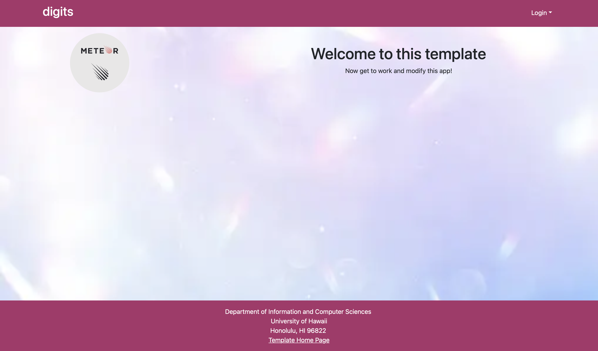

_Digits_



Digits is an application that allows users to:

Register an account.
Create and manage a set of contacts.
Add a set of timestamped notes regarding their interactions with each contact.

## Installation

First, [install Meteor](https://www.meteor.com/install).

Second, go to [https://github.com/ics-software-engineering/meteor-application-template-react](https://github.com/ics-software-engineering/meteor-application-template-react), and click the "Use this template" button. Complete the dialog box to create a new repository that you own that is initialized with this template's files.

Third, go to your newly created repository, and click the "Clone or download" button to download your new GitHub repo to your local file system.  Using [GitHub Desktop](https://desktop.github.com/) is a great choice if you use MacOS or Windows.

Fourth, cd into the app/ directory of your local copy of the repo, and install third party libraries with:

```
$ meteor npm install
```

## Running the system

Once the libraries are installed, you can run the application by invoking the "start" script in the [package.json file](https://github.com/ics-software-engineering/meteor-application-template-react/blob/master/app/package.json):

```
$ meteor npm run start
```

The first time you run the app, it will create some default users and data. Here is the output:

```
 meteor npm run start 

> meteor-application-template-react@ start /Users/carletonmoore/GitHub/ICS314/meteor-application-template-react/app
> meteor --no-release-check --exclude-archs web.browser.legacy,web.cordova --settings ../config/settings.development.json

[[[[[ ~/GitHub/ICS314/meteor-application-template-react/app ]]]]]

=> Started proxy.                             
=> Started HMR server.                        
=> Started MongoDB.                           
I20240403-18:56:21.664(-10)? Creating the default user(s)
I20240403-18:56:21.670(-10)?   Creating user admin@foo.com.
I20240403-18:56:22.169(-10)?   Creating user john@foo.com.
I20240403-18:56:22.274(-10)? Creating default contacts.
I20240403-18:56:22.275(-10)?   Adding: Johnson (john@foo.com)
I20240403-18:56:22.304(-10)?   Adding: Casanova (john@foo.com)
I20240403-18:56:22.306(-10)?   Adding: Binsted (admin@foo.com)
=> Started your app.

=> App running at: http://localhost:3000/
```

Periodically, you might see `Error starting Mongo (2 tries left): Cannot run replSetReconfig because the node is currently updating its configuration` after the `=> Started HMR server.`. It doesn't seem to be a problem since the MongoDB does start.

### Viewing the running app

If all goes well, the template application will appear at [http://localhost:3000](http://localhost:3000).  You can login using the credentials in [settings.development.json](https://github.com/ics-software-engineering/meteor-application-template-react/blob/main/config/settings.development.json), or else register a new account.

#### Landing page

When you retrieve the app at http://localhost:3000, this is what should be displayed:


The next step is to use the Login menu to either Login to an existing account or register a new account.

#### Login page

Clicking on the Login link, then on the Sign In menu item displays this page:


#### Register page

Alternatively, clicking on the Login link, then on the Sign Up menu item displays this page:


#### Landing (after Login) page, non-Admin user

Once you log in (either to an existing account or by creating a new one), the navbar changes as follows:


You can now add new contacts, and list contacts you have created. Note you cannot see any contacts created by other users.

#### Add Contact page

After logging in, here is the page that allows you to add new contact:


#### List Contact page

After logging in, here is the page that allows you to list all the contacts you have created:


You click the "Edit" link to go to the Edit contacts page, shown next.

#### Edit Contact page

After clicking on the "Edit" link associated with an item, this page displays that allows you to change and save it:


#### Landing (after Login), Admin user

You can define an "admin" user in the settings.json file. This user, after logging in, gets a special entry in the navbar:


#### Admin page (list all users contacts)

To provide a simple example of a "super power" for Admin users, the Admin page lists all of the contacts by all of the users:


Note that non-admin users cannot get to this page, even if they type in the URL by hand.

### Quality Assurance

#### ESLint

The application includes a [.eslintrc](https://github.com/ics-software-engineering/meteor-application-template-react/blob/main/app/.eslintrc) file to define the coding style adhered to in this application. You can invoke ESLint from the command line as follows:

```
[~/meteor-application-template-react/app]-> meteor npm run lint

> meteor-application-template-react@ lint /Users/philipjohnson/meteor-application-template-react/app
> eslint --quiet ./imports
```

ESLint should run without generating any errors.

It's significantly easier to do development with ESLint integrated directly into your IDE (such as IntelliJ).

  * [Walkthrough of system user interface (6 min)](https://youtu.be/48xu1hrqUi8)
  * [Data and accounts structure and initialization (18 min)](https://youtu.be/HZRjwrVBWp4)
  * [Navigation, routing, pages, components (34 min)](https://youtu.be/XztTdHpv6Jw)
  * [Forms (32 min)](https://youtu.be/8FyWR3gUGCM)
  * [Authorization, authentication, and roles (12 min)](https://youtu.be/9HX5vuXTlvA)
